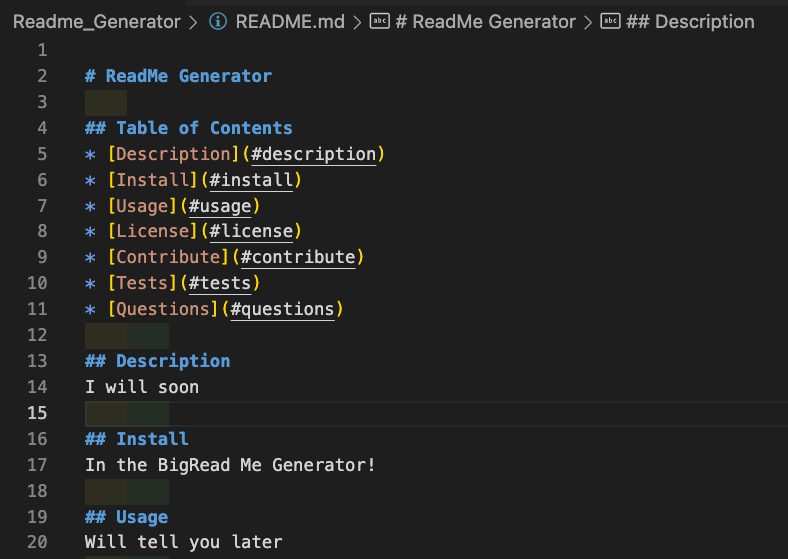

# Password-Generator

## Table of Contents

- [Description](#Description)

- [Installation](#Installation)

- [Usage](#Usage)

- [License](#License)

- [Contribute](#Contribute)

- [Tests](#Tests)

- [Questions](#Questions)

## Description

The ReadMe Generator project is an assignment that asks for the web developer to create a ReadMe Generator and add specific criteria in order to have the commonly accepted categories of a ReadMe Generator by using javascript.

A link to the video is found here: (https://drive.google.com/file/d/1c13Qx7-G_GD0SLQ_BPDieFz3RTwSZ0UE/view)

The program requires a basic opearting system such as windows or iOS needs a web browswer.

## Installation

The program requires a basic opearting system such as windows or iOS needs a web browser. 

## Usage

The program begins by running node index.js in the integrated terminal. A prompt then asks the user to begin answering pre-assigned questions that the programer has put into the javascript file by utilizing a markdown javascript file. At that point, the user enters all of the data requested. Then at the end of the process a Succesful README Generated message appears. and a Readme.md file is populated.

## License

This application is covered under the GNU GPLv3.0 License.

## Contribute

Justin Morrow

## Tests

No Tests.

## Questions

If you have questions, please contact me at the information below:

GitHub: [Justin Morrow](https://github.com/Justin-Morrow)